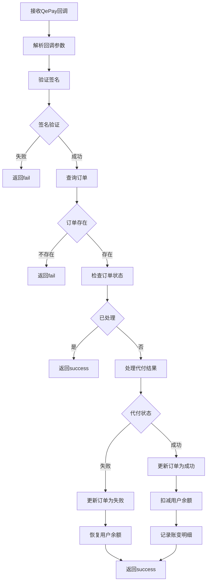

# QePay代付回调接口实现说明

## 概述

根据QePay官方规范，实现了完整的代付回调处理机制，支持重复通知处理和幂等性保证。

## 回调机制说明

### 1. 通知机制
- **代付结果**: 代付成功后会发送异步通知，代付结果需根据后台通知为准
- **重复通知**: 异常未收到通知，平台会按照规律重复发送通知，成功之后是连续发8次
- **停止条件**: 异步通知在处理成功之后需要向平台返回"success"，平台收到success后将不会再发送通知
- **重试机制**: 如果返回"fail"，平台会继续重试发送通知

### 2. 回调接口

```
POST /api/qepay/payout/notify
Content-Type: application/x-www-form-urlencoded
```

## 回调参数

| 参数值 | 参数名 | 类型 | 是否必填 | 说明 |
|--------|--------|------|----------|------|
| tradeResult | 订单状态 | String | Y | 1:代付成功，2:代付失败 |
| merTransferId | 商家转账单号 | String | Y | 代付使用的转账单号 |
| merNo | 商户代码 | String | Y | 平台分配唯一 |
| tradeNo | 平台订单号 | String | Y | 平台唯一 |
| transferAmount | 代付金额 | String | Y | 元为单位保留两位小数 |
| applyDate | 订单时间 | String | Y | 订单时间 |
| version | 版本号 | String | Y | 默认1.0 |
| respCode | 回调状态 | String | Y | 默认SUCCESS |
| sign | 签名 | String | N | 不参与签名 |
| signType | 签名方式 | String | N | MD5 不参与签名 |

## 回调示例

### 代付成功回调示例
```bash
curl -X POST "http://your-domain.com/api/qepay/payout/notify" \
  -H "Content-Type: application/x-www-form-urlencoded" \
  -d "tradeResult=1&merTransferId=20201201113359&merNo=123456666&tradeNo=3000025&transferAmount=10000.00&sign=0f919e357c71c7013665e253cf1d4be7&signType=MD5&applyDate=2020-12-01 11:33:59&version=1.0&respCode=SUCCESS"
```

### 代付失败回调示例
```bash
curl -X POST "http://your-domain.com/api/qepay/payout/notify" \
  -H "Content-Type: application/x-www-form-urlencoded" \
  -d "tradeResult=2&merTransferId=20201201113360&merNo=123456666&tradeNo=3000026&transferAmount=5000.00&sign=abc123&signType=MD5&applyDate=2020-12-01 11:35:00&version=1.0&respCode=SUCCESS"
```

## 实现特性

### 1. 重复通知处理
- **幂等性**: 相同订单号的重复回调只处理一次
- **状态检查**: 已处理的订单直接返回success
- **日志记录**: 详细记录每次回调的处理过程

### 2. 签名验证
- **严格验证**: 使用QePay官方MD5签名算法
- **参数排序**: 按照ASCII码排序参数
- **密钥验证**: 使用商户配置的密钥进行验证

### 3. 业务处理
- **代付成功**: 更新订单状态，扣减用户余额，记录账变
- **代付失败**: 更新订单状态，恢复用户余额
- **异常处理**: 完整的异常捕获和错误日志

### 4. 响应机制
- **成功响应**: 返回"success"，平台停止发送通知
- **失败响应**: 返回"fail"，平台继续重试
- **日志记录**: 详细记录响应原因

## 处理流程



## 关键代码实现

### 1. 回调接口
```java
@PostMapping(value = "/payout/notify", consumes = "application/x-www-form-urlencoded")
@ApiOperation("QePay代付结果异步通知")
public String qePayPayoutNotify(@RequestParam Map<String, String> params) {
    // 处理回调逻辑
    return success ? "success" : "fail";
}
```

### 2. 重复处理检查
```java
// 检查订单状态，避免重复处理
if (withdrawOrder.getState() != null && withdrawOrder.getState() == 2) {
    logger.info("QePay代付订单已处理过 - 订单号: {}", orderNo);
    return true;
}
```

### 3. 签名验证
```java
// 构建签名数据
Map<String, Object> signData = new HashMap<>();
signData.put("tradeResult", callbackData.getTradeResult());
// ... 其他参数

// 生成签名
String expectedSign = QePaySignatureUtils.generateSign(signData, payMerchant.getChannelkey());

// 验证签名
boolean isValid = expectedSign.equals(callbackData.getSign());
```

## 测试验证

### 1. 单元测试
```bash
# 运行单元测试
mvn test -Dtest=QePayCallbackTest
```

### 2. 集成测试
```bash
# 运行详细测试脚本
./test_qepay_callback_detailed.sh
```

### 3. 重复通知测试
测试脚本会模拟QePay的8次重复通知机制，验证：
- 第一次通知处理成功并返回success
- 后续重复通知直接返回success
- 平台收到success后停止发送通知

## 监控和日志

### 1. 关键日志
- 回调接收日志
- 签名验证结果
- 订单处理状态
- 重复处理提醒
- 异常错误信息

### 2. 监控指标
- 回调成功率
- 重复通知比例
- 处理响应时间
- 签名验证失败率

## 配置要求

### 1. 回调URL配置
```java
// 在QePayPayoutServiceImpl中配置
private static final String PAYOUT_NOTIFY_URL = "https://your-domain.com/api/qepay/payout/notify";
```

### 2. 商户配置
```java
// 商户信息必须包含
merchantCode: "QEPAY*"  // 必须以QEPAY开头
merchantno: "QEPAY123456"  // QePay分配的商户代码
channelkey: "your_secret_key"  // QePay分配的密钥
```

## 注意事项

### 1. 重复通知处理
- 必须支持重复通知的幂等处理
- 已处理的订单应直接返回success
- 避免重复扣减用户余额

### 2. 签名验证
- 严格按照QePay官方规则验证签名
- 排除sign和signType字段参与签名
- 使用正确的商户密钥

### 3. 响应机制
- 处理成功必须返回"success"
- 处理失败必须返回"fail"
- 平台根据响应决定是否继续重试

### 4. 异常处理
- 所有异常都要返回"fail"
- 详细记录异常信息
- 确保系统稳定性

## 扩展功能

### 1. 通知重试监控
可以添加监控机制，统计重复通知次数和处理结果

### 2. 回调数据存储
可以存储回调数据用于审计和问题排查

### 3. 异步处理
可以添加异步处理机制提高响应速度

## 联系支持

如有问题，请查看：
1. 详细实现代码：`QePayCallbackController.java`
2. 测试脚本：`test_qepay_callback_detailed.sh`
3. 相关文档和日志
