# 用户业务流程图

## 📋 目录
- [1. 用户注册与登录流程](#1-用户注册与登录流程)
- [2. 充值流程](#2-充值流程)
- [3. 投资流程](#3-投资流程)
- [4. 提现流程](#4-提现流程)
- [5. 签到与奖励流程](#5-签到与奖励流程)
- [6. 代理佣金流程](#6-代理佣金流程)
- [7. 系统监控流程](#7-系统监控流程)
- [8. 安全与风控](#8-安全与风控)
- [9. 数据统计与报表](#9-数据统计与报表)
- [10. 核心业务特点](#10-核心业务特点)

---

## 1. 用户注册与登录流程

### 1.1 用户注册流程

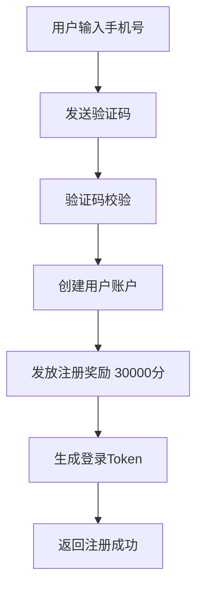

**关键步骤：**
- 手机号格式验证
- 验证码发送与校验
- 用户信息创建
- 注册奖励发放
- 登录Token生成

### 1.2 用户登录流程

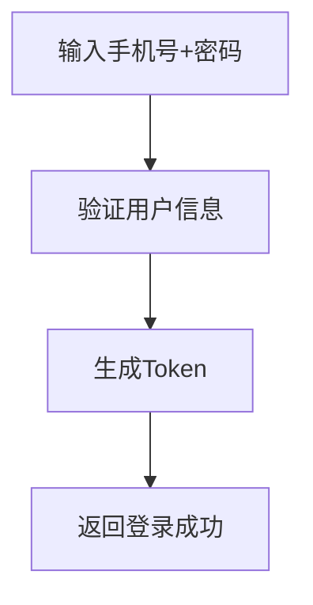

**关键步骤：**
- 用户身份验证
- Token生成与过期时间设置
- 登录日志记录

---

## 2. 充值流程

### 2.1 USDT充值流程

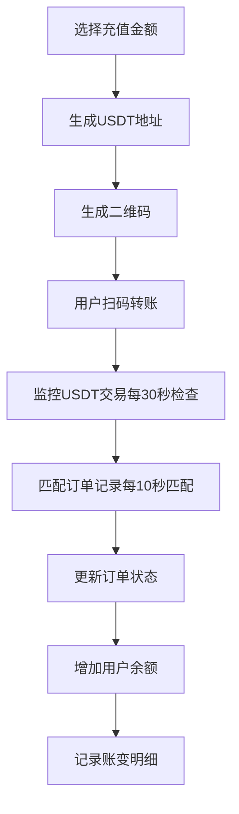

**关键步骤：**
- USDT地址生成
- 二维码生成
- 实时交易监控
- 订单自动匹配
- 余额更新

### 2.2 其他充值方式流程

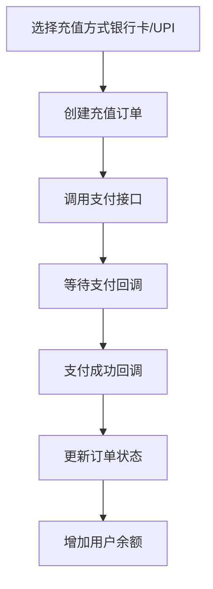

**支持的充值方式：**
- 银行卡充值
- UPI充值
- Paytm充值
- 虚拟币充值

---

## 3. 投资流程

### 3.1 投资项目流程

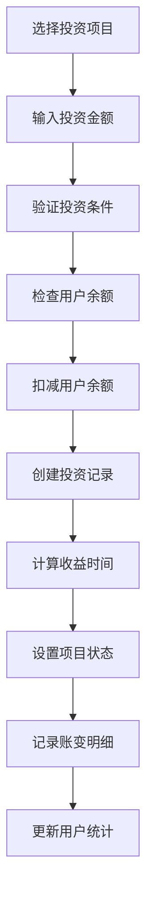

**关键步骤：**
- 投资条件验证
- 余额扣减（原子操作）
- 投资记录创建
- 收益时间计算
- 账变明细记录

### 3.2 投资收益流程

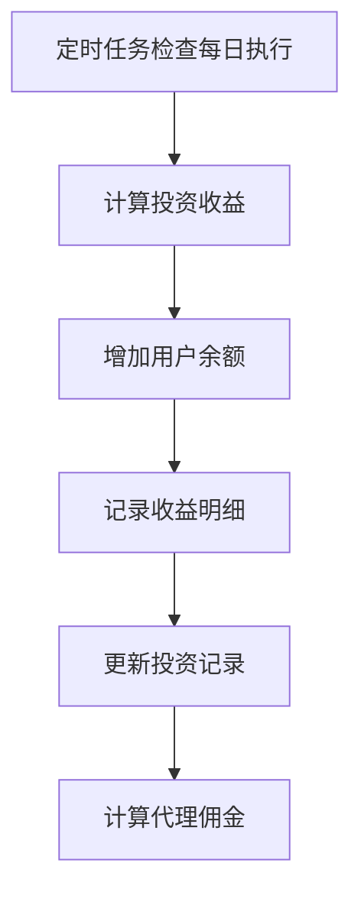

**关键步骤：**
- 定时任务调度
- 收益自动计算
- 余额自动增加
- 代理佣金计算

---

## 4. 提现流程

### 4.1 余额提现流程

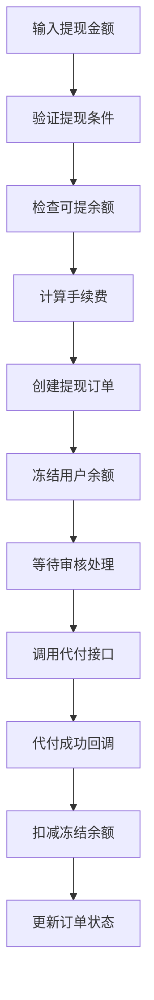

**关键步骤：**
- 提现条件验证
- 余额冻结机制
- 手续费计算
- 代付接口调用
- 回调处理

### 4.2 佣金提现流程

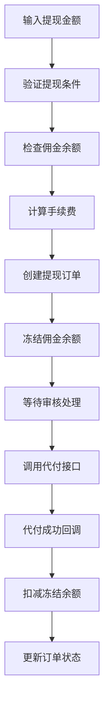

**提现类型：**
- 余额提现（类型2）
- 佣金提现（类型33）

---

## 5. 签到与奖励流程

### 5.1 每日签到流程

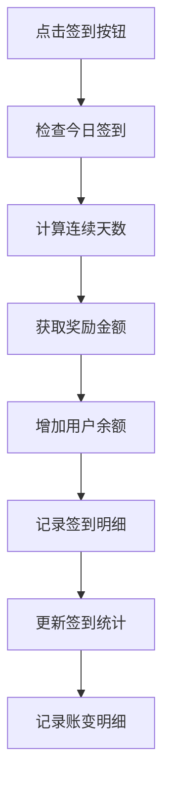

**签到奖励规则：**
- 连续签到1-7天循环
- 不同天数对应不同奖励
- 签到统计记录

### 5.2 VIP等级领取流程

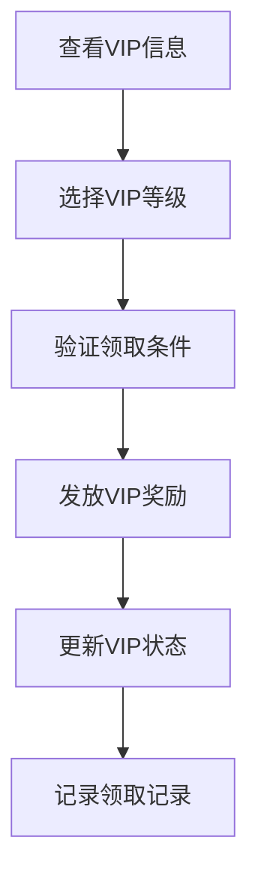

**VIP等级条件：**
- 基于投资金额
- 基于邀请人数
- 基于其他业务指标

---

## 6. 代理佣金流程

### 6.1 代理佣金计算流程

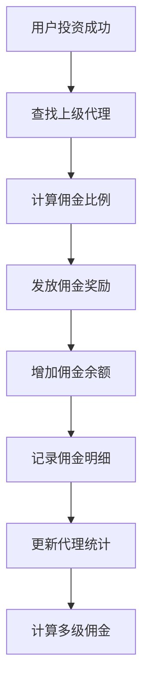

**佣金计算规则：**
- 多级代理体系
- 不同层级不同比例
- 实时计算发放

---

## 7. 系统监控流程

### 7.1 USDT交易监控流程

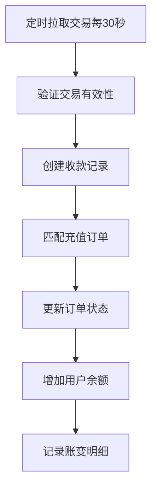

**监控特点：**
- 只获取转入交易（only_to=true）
- 严格验证交易有效性
- 自动匹配充值订单

### 7.2 投资收益计算流程

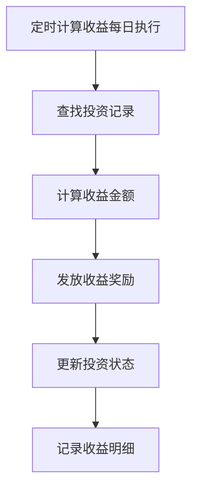

---

## 8. 安全与风控

### 8.1 安全验证流程

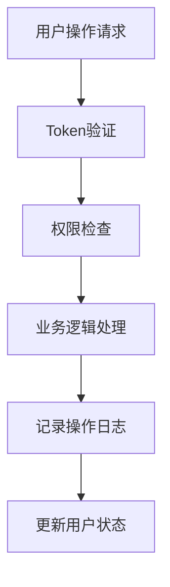

### 8.2 分布式锁保护

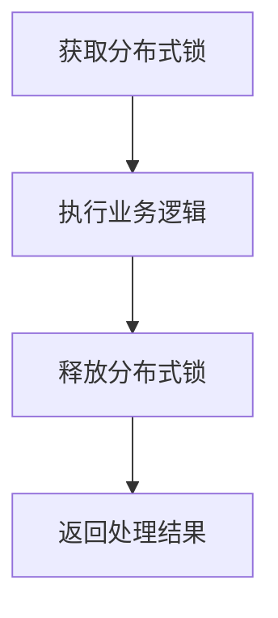

**风控机制：**
- 分布式锁防并发
- 余额验证防超支
- 状态检查防重复
- 操作日志记录

---

## 9. 数据统计与报表

### 9.1 用户数据统计流程

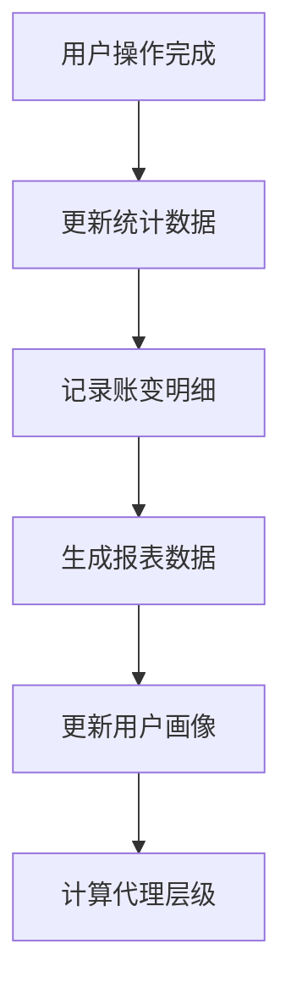

**统计维度：**
- 用户投资统计
- 代理佣金统计
- 充值提现统计
- 签到奖励统计

---

## 10. 核心业务特点

### 10.1 技术特点

| 特点 | 描述 |
|------|------|
| **多币种支持** | 支持USDT、银行卡、UPI、Paytm等多种充值方式 |
| **实时监控** | USDT交易实时监控和自动匹配 |
| **多层代理** | 支持多级代理佣金计算 |
| **定时任务** | 投资收益自动计算和发放 |
| **风控机制** | 分布式锁、余额验证、状态检查 |
| **完整记录** | 所有操作都有详细的账变记录和日志 |

### 10.2 业务特点

| 业务模块 | 核心功能 |
|----------|----------|
| **用户管理** | 注册、登录、身份验证、Token管理 |
| **充值系统** | 多方式充值、实时监控、自动匹配 |
| **投资系统** | 项目投资、收益计算、自动发放 |
| **提现系统** | 余额提现、佣金提现、代付处理 |
| **奖励系统** | 签到奖励、VIP奖励、注册奖励 |
| **代理系统** | 多级代理、佣金计算、层级管理 |
| **监控系统** | 交易监控、定时任务、状态同步 |

### 10.3 数据流转

### 10.4 关键接口

| 接口类型 | 主要功能 |
|----------|----------|
| **用户接口** | 注册、登录、信息查询、余额查询 |
| **充值接口** | 创建订单、支付回调、状态查询 |
| **投资接口** | 项目列表、投资下单、收益查询 |
| **提现接口** | 提现申请、状态查询、回调处理 |
| **奖励接口** | 签到、VIP领取、奖励查询 |
| **代理接口** | 佣金查询、团队统计、层级管理 |

---

## 📝 总结

本系统是一个完整的金融投资平台，涵盖了用户注册、充值、投资、提现、奖励、代理等完整的业务闭环。系统采用现代化的技术架构，具备高并发、高可用、数据一致性等特点，为用户提供了安全、便捷的投资服务。

**主要优势：**
- 完整的业务流程覆盖
- 实时的交易监控
- 自动化的收益计算
- 多层次的代理体系
- 完善的风控机制
- 详细的账变记录

**技术亮点：**
- 分布式锁保证数据一致性
- 定时任务自动化处理
- 实时API监控
- 多语言国际化支持
- 完善的异常处理机制
